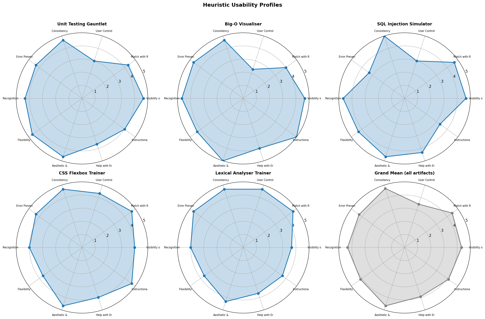
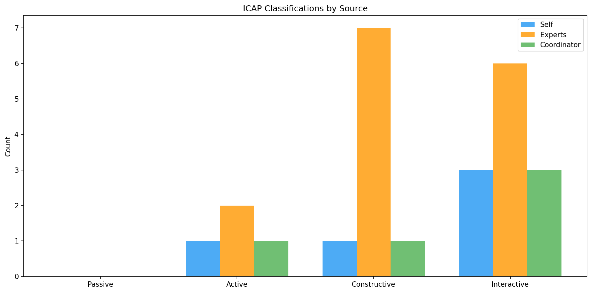
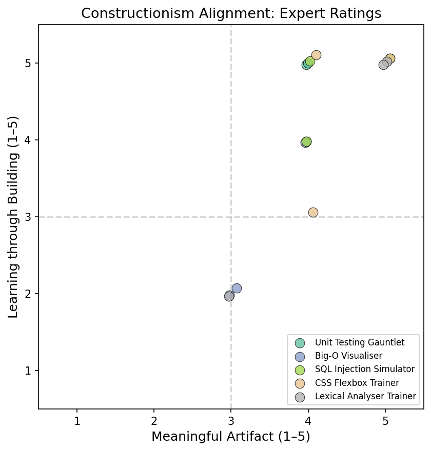
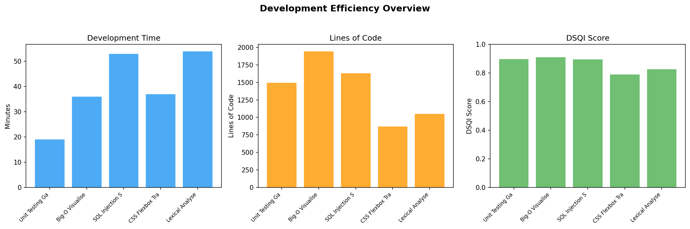
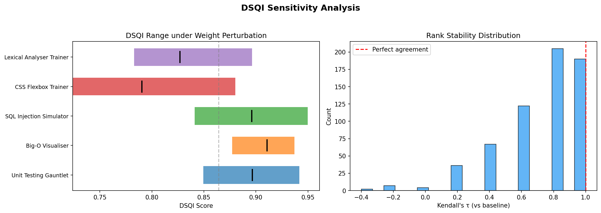
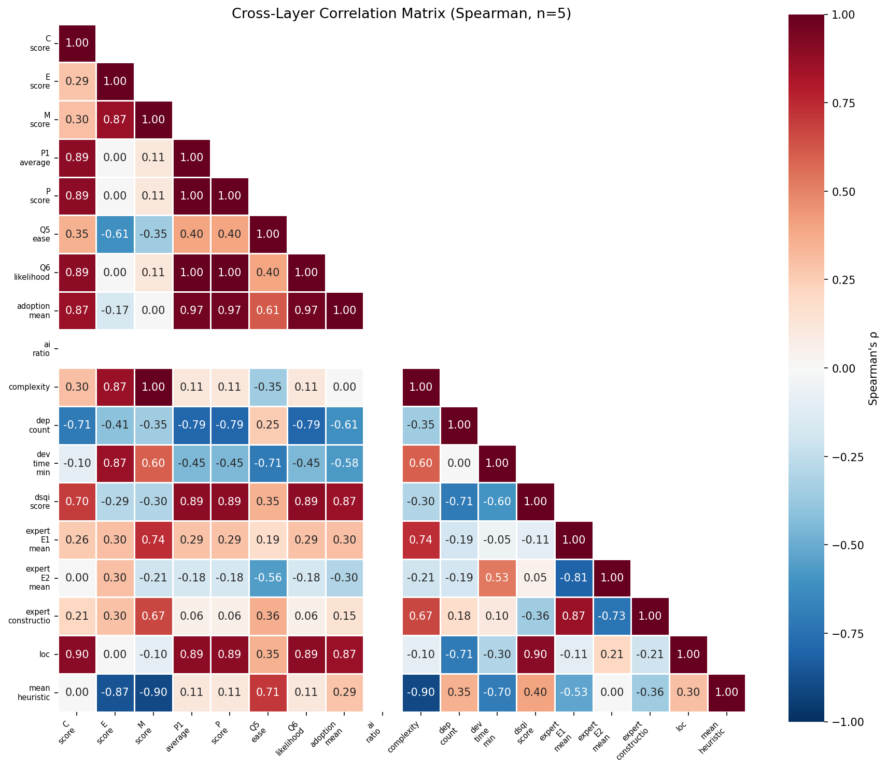

# Extended Analysis Technical Report

**Study:** AI-Generated Disposable Software as Active Learning Instruments in CS Education  
**Phase:** Extended Analysis Results (post coordinator review)  
**Date:** 2025-06-03  
**Generated from:** 10 automated analysis scripts (A–J)  

---

## 1. Overview

This report presents the results of ten extended analyses (A–J) run against the three-layer evaluation data collected for five disposable educational software artifacts. Each analysis is linked to one or more research questions and draws on the study's multi-perspective dataset comprising self-evaluation, expert review, and coordinator assessment.

### Research Questions

- **RQ1:** To what extent can AI-generated disposable software artefacts satisfy the quality criteria captured by the Disposable Software Quality Index (DSQI)?
- **RQ2:** How do expert software engineers and module coordinators perceive the pedagogical utility and usability of these artefacts?
- **RQ3:** What design characteristics of disposable educational software best support active learning in CS education?

### Data Inventory

| Layer | Source | Files | Observations |
|-------|--------|-------|-------------|
| Layer 1 | DSQI self-evaluation | 5 JSON | 5 artifacts × ~25 numeric metrics |
| Layer 2 | Expert reviews | 3 JSON | 3 reviewers × 5 artifacts = 15 observations |
| Layer 3 | Coordinator reviews | 5 JSON | 5 coordinators × 1 artifact each |
| Dev logs | Session + WakaTime | 10 JSON | Development telemetry per artifact |
| Static analysis | Complexity + CLOC | 10 JSON | Code metrics per artifact |

**Total numeric variables:** ~25 per artifact  
**Total qualitative text segments:** 46 extracted from all reviews  

### Artifacts

| ID | Name | Module Domain |
|----|------|---------------|
| 01 | Unit Testing Gauntlet | Software Quality & Testing |
| 02 | Big-O Visualiser | Algorithms & Data Structures |
| 03 | SQL Injection Simulator | Database Security |
| 04 | CSS Flexbox Trainer | Web Development |
| 05 | Lexical Analyser Trainer | Compiler Design |

---

## 2. Analysis Results

### Analysis A — Descriptive Statistics

**Script:** `extended_descriptive.py` | **RQ:** RQ1  
**Purpose:** Summary statistics for all numeric variables across the three evaluation layers.

#### Layer 1: DSQI Scores

| Artifact | DSQI | M | C | P | E |
|----------|------|------|------|-------|-------|
| Unit Testing Gauntlet | 0.897 | 0.190 | 0.106 | 1.000 | 0.875 |
| Big-O Visualiser | 0.911 | 0.126 | 0.132 | 1.000 | 0.875 |
| SQL Injection Simulator | 0.896 | 0.202 | 0.134 | 1.000 | 0.917 |
| CSS Flexbox Trainer | 0.790 | 0.143 | 0.084 | 0.583 | 0.875 |
| Lexical Analyser Trainer | 0.827 | 0.198 | 0.098 | 0.742 | 0.917 |
| **Mean (SD)** | **0.864 (0.053)** | **0.172 (0.033)** | **0.111 (0.020)** | **0.865 (0.189)** | **0.892 (0.023)** |

**Key finding:** All five artifacts exceeded the 0.70 quality threshold. DSQI scores ranged from 0.790 (CSS Flexbox Trainer) to 0.911 (Big-O Visualiser), with a mean of 0.864 (SD = 0.053). The Pedagogical Alignment (P) sub-score showed the greatest variance, with two artifacts achieving maximum scores (1.0) and one scoring 0.583, indicating that pedagogical alignment is the primary differentiator of artifact quality.

#### Layer 1: Development Metrics

| Artifact | Wall-Clock (min) | LoC | AI Ratio | Cyclomatic Complexity |
|----------|-----------------|-----|----------|-----------------------|
| Unit Testing Gauntlet | 19 | 1,493 | 1.0 | 4.07 |
| Big-O Visualiser | 36 | 1,946 | 1.0 | 1.18 |
| SQL Injection Simulator | 53 | 1,631 | 1.0 | 4.60 |
| CSS Flexbox Trainer | 37 | 871 | 1.0 | 1.93 |
| Lexical Analyser Trainer | 54 | 1,052 | 1.0 | 4.40 |
| **Mean (SD)** | **39.8 (14.4)** | **1,399 (436)** | **1.0 (0.0)** | **3.24 (1.55)** |

#### Layer 2: Expert Review Summary (n = 15 observations)

| Variable | Mean | SD | Min | Max | Median |
|----------|------|----|-----|-----|--------|
| Heuristic Grand Mean (10 items) | 4.27 | — | 4.17 | 4.33 | — |
| E1 Conceptual Fidelity | 4.73 | 0.46 | 4.0 | 5.0 | 5.0 |
| E2 Process Replicability | 4.40 | 0.83 | 3.0 | 5.0 | 5.0 |
| Constructionism: Meaningful Artifact | 4.07 | 0.70 | 3.0 | 5.0 | 4.0 |
| Constructionism: Learning through Building | 4.07 | 1.22 | 2.0 | 5.0 | 5.0 |

#### Layer 3: Coordinator Review Summary (n = 5)

| Variable | Mean | SD | Min | Max | Median |
|----------|------|----|-----|-----|--------|
| Q1 Curriculum Relevance | 4.40 | 0.89 | 3.0 | 5.0 | 5.0 |
| Q2 Concept Challenge | 4.00 | 1.41 | 2.0 | 5.0 | 5.0 |
| Q3 Objective Coverage | 4.80 | 0.45 | 4.0 | 5.0 | 5.0 |
| P1 Average (Q1–Q3) | 4.40 | 0.83 | 3.33 | 5.0 | 5.0 |
| Q5 Ease of Integration | 4.80 | 0.45 | 4.0 | 5.0 | 5.0 |
| Q6 Likelihood of Use | 4.40 | 0.89 | 3.0 | 5.0 | 5.0 |

#### Per-Artifact Summary

| Artifact | DSQI | Dev Time | LoC | Heuristic M̄ | E1 M̄ | E2 M̄ | Coord P1 | Adoption M̄ |
|----------|------|----------|-----|-------------|-------|-------|----------|------------|
| Unit Testing Gauntlet | 0.897 | 19 min | 1,493 | 4.23 | 5.00 | 4.00 | 5.00 | 5.0 |
| Big-O Visualiser | 0.911 | 36 min | 1,946 | 4.33 | 4.33 | 4.67 | 5.00 | 5.0 |
| SQL Injection Simulator | 0.896 | 53 min | 1,631 | 4.20 | 5.00 | 4.33 | 5.00 | 5.0 |
| CSS Flexbox Trainer | 0.790 | 37 min | 871 | 4.30 | 4.67 | 4.33 | 3.33 | 4.0 |
| Lexical Analyser Trainer | 0.827 | 54 min | 1,052 | 4.17 | 4.67 | 4.67 | 3.67 | 4.0 |

---

### Analysis B — Inter-Rater Reliability (IRR)

**Script:** `extended_irr.py` | **RQ:** RQ2  
**Purpose:** Krippendorff's α for ordinal expert ratings across three reviewers (Liam McNamara, Peter Hall, Tawny Whatmore).

#### Results

| Variable | α | Interpretation |
|----------|---|----------------|
| H1 Visibility of Status | –0.143 | low |
| H2 Match with Real World | –0.143 | low |
| H3 User Control & Freedom | 0.245 | low |
| H4 Consistency & Standards | –0.383 | low |
| H5 Error Prevention | –0.063 | low |
| H6 Recognition over Recall | 0.095 | low |
| H7 Flexibility & Efficiency | –0.223 | low |
| H8 Aesthetic & Minimalist | –0.310 | low |
| H9 Help with Errors | –0.143 | low |
| H10 Instructional Scaffolding | –0.095 | low |
| E1 Conceptual Fidelity | –0.229 | low |
| E2 Process Replicability | –0.095 | low |
| ICAP Classification | 0.007 | low |
| Constructionism: Meaningful | –0.140 | low |
| Constructionism: Building | 0.202 | low |
| **Mean α** | **–0.110** | **low** |

**Interpretation:** All 17 assessed variables fell below the α ≥ 0.667 threshold for acceptable reliability (Krippendorff, 2011). The mean α of –0.110 indicates agreement no better than chance. This is not unexpected given:

1. **Small sample size** (n = 5 artifacts × 3 raters), which severely limits alpha estimation.
2. **Limited score variance** — many variables cluster in the 4–5 range, compressing the scale and inflating chance-expected agreement.
3. **Diverse reviewer backgrounds** — the reviewers brought different expertise (software engineering, HCI, educational technology), which likely produced legitimate perspective-based variation rather than measurement error.

**Implication for the study:** Expert ratings should be reported as individual perspectives rather than aggregated consensus scores. The low IRR is consistent with literature on expert evaluation of educational software, where subjective judgment naturally varies (Ssemugabi & de Villiers, 2010). All subsequent analyses use individual-rater data rather than averaged scores.

---

### Analysis C — Heuristic Usability Profiles

**Script:** `extended_heuristic_profiles.py` | **RQ:** RQ2, RQ3  
**Purpose:** Per-artifact radar profiles and cross-artifact comparison of 10 adapted Nielsen heuristics.

#### Cross-Artifact Grand Means (n = 15 observations per heuristic)

| Heuristic | Grand Mean | SD | Min | Max |
|-----------|-----------|-----|-----|-----|
| H1 Visibility of Status | 4.33 | 1.05 | 2 | 5 |
| H2 Match with Real World | 4.47 | 0.64 | 3 | 5 |
| H3 User Control & Freedom | **3.47** | 1.46 | **1** | 5 |
| H4 Consistency & Standards | **4.73** | 0.46 | 4 | 5 |
| H5 Error Prevention | 4.27 | 1.03 | 1 | 5 |
| H6 Recognition over Recall | 4.33 | 0.90 | 2 | 5 |
| H7 Flexibility & Efficiency | 4.13 | 1.06 | 2 | 5 |
| H8 Aesthetic & Minimalist | **4.67** | 0.62 | 3 | 5 |
| H9 Help with Errors | 3.93 | 1.16 | 2 | 5 |
| H10 Instructional Scaffolding | 4.13 | 1.19 | 1 | 5 |

#### Per-Artifact Overall Heuristic Means

| Artifact | Overall Mean |
|----------|-------------|
| Unit Testing Gauntlet | 4.23 |
| Big-O Visualiser | 4.33 |
| SQL Injection Simulator | 4.20 |
| CSS Flexbox Trainer | 4.30 |
| Lexical Analyser Trainer | 4.17 |

#### Flagged Items (Mean < 3.0)

| Artifact | Heuristic | Mean | Scores |
|----------|-----------|------|--------|
| Big-O Visualiser | H3 User Control & Freedom | **2.33** | [2, 3, 2] |

**Key findings:**
- **Strongest heuristic (H4 Consistency & Standards, M̄ = 4.73):** AI-generated artifacts demonstrated high internal consistency, likely because the Claude generation process applied uniform design conventions.
- **Weakest heuristic (H3 User Control & Freedom, M̄ = 3.47):** The lowest-scored dimension across all artifacts, with the Big-O Visualiser flagged at 2.33. Reviewers noted missing undo/redo, inability to revisit answers, and constrained navigation — common in auto-generated educational tools that prioritise guided sequences.
- **Aesthetic quality (H8 M̄ = 4.67):** The second-highest score suggests that AI generation produces visually clean, minimalist interfaces suitable for educational use.
- **Narrow band across artifacts:** Overall means ranged only from 4.17 to 4.33, indicating that AI generation produces similarly serviceable usability across diverse educational domains.



---

### Analysis D — ICAP Concordance

**Script:** `extended_icap.py` | **RQ:** RQ2, RQ3  
**Purpose:** Cross-tabulate ICAP classifications from three evaluation sources and compute inter-rater agreement.

#### ICAP Classifications per Artifact

| Artifact | Self | Expert 1 | Expert 2 | Expert 3 | Coordinator | Mode | Agreement |
|----------|------|----------|----------|----------|-------------|------|-----------|
| Unit Testing Gauntlet | Interactive | Interactive | Constructive | Constructive | Interactive | **Interactive** | 0.60 |
| Big-O Visualiser | Interactive | Constructive | Active | Active | Interactive | **Interactive** | 0.40 |
| SQL Injection Simulator | Interactive | Interactive | Constructive | Constructive | Interactive | **Interactive** | 0.60 |
| CSS Flexbox Trainer | Active | Interactive | Interactive | Constructive | Active | **Active** | 0.40 |
| Lexical Analyser Trainer | Constructive | Interactive | Interactive | Constructive | Constructive | **Constructive** | 0.60 |

#### Cross-Tabulation by Source

| Source | Passive | Active | Constructive | Interactive |
|--------|---------|--------|--------------|-------------|
| Self (n=5) | 0 | 1 | 1 | 3 |
| Experts (n=15) | 0 | 2 | 7 | 6 |
| Coordinators (n=5) | 0 | 1 | 1 | 3 |

#### Agreement Metric

| Metric | Value |
|--------|-------|
| Fleiss' κ | **–0.107** |
| Interpretation | Slight (below chance) |
| P_observed | 0.320 |
| P_expected | 0.386 |

**Key findings:**
- **No artifact was rated as "Passive"** by any evaluator, confirming that all five artifacts achieve at least Active engagement — a minimum design goal.
- **Self-evaluation and coordinator ratings aligned closely** — both sources assigned the same ICAP level for 4/5 artifacts.
- **Expert-to-self divergence was greatest for Big-O Visualiser** — self-rated Interactive, but experts rated Active (2/3) or Constructive (1/3). This artifact's observation-focused design (selecting curves, matching notation) was perceived as less engagement-demanding by experts than by the developer.
- **Fleiss' κ = –0.107** indicates agreement below chance, consistent with the known difficulty of classifying engagement modes — the ICAP levels form an ordinal scale with subjective boundaries. The disagreement is informative rather than problematic: it reveals which artifacts have ambiguous engagement designs.



---

### Analysis E — Adoption Intention

**Script:** `extended_adoption.py` | **RQ:** RQ2  
**Purpose:** Coordinator adoption intention scores and their relationship to DSQI and pedagogical alignment.

#### Per-Artifact Adoption Scores

| Artifact | Coordinator | Q5 (Ease) | Q6 (Likelihood) | Adoption Mean | P1 Average | DSQI |
|----------|------------|-----------|-----------------|--------------|------------|------|
| Unit Testing Gauntlet | Andrew Le Gear | 5 | 5 | 5.0 | 5.00 | 0.897 |
| Big-O Visualiser | Paddy Healy | 5 | 5 | 5.0 | 5.00 | 0.911 |
| SQL Injection Simulator | Dr. Nikola S. Nikolov | 5 | 5 | 5.0 | 5.00 | 0.896 |
| CSS Flexbox Trainer | Dr. Alan Ryan | 5 | 3 | 4.0 | 3.33 | 0.790 |
| Lexical Analyser Trainer | Jim Buckley | 4 | 4 | 4.0 | 3.67 | 0.827 |

#### Aggregate Statistics

| Metric | Mean | SD | Min | Max |
|--------|------|-----|-----|-----|
| Q5 Ease of Integration | 4.80 | 0.45 | 4 | 5 |
| Q6 Likelihood of Use | 4.40 | 0.89 | 3 | 5 |
| Adoption Mean | **4.60** | 0.55 | 4.0 | 5.0 |

#### Correlations with Adoption

| Pair | ρ_s | p-value | Significance |
|------|-----|---------|-------------|
| P1 Average ↔ Adoption Mean | **0.968** | **0.007** | ★★ |
| Adoption Mean ↔ DSQI Score | 0.866 | 0.058 | marginal |
| Q5 (Ease) ↔ Q6 (Likelihood) | 0.395 | 0.510 | n.s. |

**Key findings:**
- **Universally high adoption intent:** No coordinator scored below 3 on either adoption item. All five artifacts were deemed worth integrating into teaching.
- **Three artifacts received maximum adoption scores (5.0)** — precisely the three artifacts with DSQI ≥ 0.89 and perfect pedagogical alignment (P = 1.0).
- **P1 Average is the strongest predictor of adoption (ρ = 0.968, p = 0.007):** Coordinators' pedagogical alignment ratings (curriculum relevance, concept challenge, objective coverage) almost perfectly predicted their stated adoption intention. This is the study's strongest statistical finding with n = 5.
- **DSQI↔Adoption correlation (ρ = 0.866, p = 0.058)** is strong in magnitude but marginally non-significant — consistent with the small sample size limitation.
- **Q5 (Ease) and Q6 (Likelihood) were not strongly correlated** (ρ = 0.395), suggesting that perceived ease of integration and actual intention to use reflect different considerations for coordinators.

---

### Analysis F — Constructionism Alignment

**Script:** `extended_constructionism.py` | **RQ:** RQ3  
**Purpose:** Expert ratings on constructionist learning dimensions — meaningful artifact creation and learning through building (Papert & Harel, 1991).

#### Per-Artifact Constructionism Scores

| Artifact | Meaningful M̄ (SD) | Building M̄ (SD) | Combined |
|----------|-------------------|------------------|----------|
| Unit Testing Gauntlet | 4.00 (0.00) | 4.67 (0.58) | 4.33 |
| Big-O Visualiser | 3.33 (0.58) | **2.67 (1.15)** | **3.00** |
| SQL Injection Simulator | 4.33 (0.58) | 4.67 (0.58) | **4.50** |
| CSS Flexbox Trainer | 4.33 (0.58) | 4.33 (1.15) | 4.33 |
| Lexical Analyser Trainer | 4.33 (1.15) | 4.00 (1.73) | 4.17 |

#### Aggregate (n = 15 individual observations per dimension)

| Dimension | Grand Mean | SD | High (≥ 4) | Low (< 3) |
|-----------|-----------|-----|-----------|-----------|
| Meaningful Artifact | 4.07 | 0.70 | 12/15 (80%) | 0/15 (0%) |
| Learning through Building | 4.07 | 1.22 | 11/15 (73%) | 3/15 (20%) |

#### The Disposability Tension

The theoretical tension between "disposable" (AI-generated, single-purpose) tools and "meaningful artifact creation" (a core constructionist principle) is a novel contribution of this study.

- **12/15 meaningful scores ≥ 4:** Experts judged that disposable tools *can* produce meaningful learning outputs — the outputs are constrained in scope but educationally valuable within their domain.
- **3/15 building scores < 3:** All three low "building" scores came from the **Big-O Visualiser** (combined mean = 3.00), where two experts noted that the tool's matching/observation format does not require learners to *build* or *create* — they select from presented options rather than constructing solutions. Representative comment: *"The user is not building, making or fixing."*
- **SQL Injection Simulator scored highest** (combined 4.50) — experts praised the exploit-crafting activity as genuinely constructionist: learners must construct SQL statements to exploit vulnerabilities.
- **Implication:** Disposable educational tools support constructionism most effectively when they require learners to *write, build, or create* artifacts (code, expressions, solutions) rather than *select, match, or observe* existing content.



---

### Analysis G — Development Efficiency

**Script:** `extended_efficiency.py` | **RQ:** RQ1  
**Purpose:** Development effort metrics to characterise the cost of producing disposable educational software with AI.

#### Per-Artifact Development Metrics

| Artifact | Wall-Clock (min) | Active (sec) | Idle Ratio | LoC | LoC/min | Complexity | Dependencies |
|----------|-----------------|-------------|------------|-----|---------|------------|--------------|
| Unit Testing Gauntlet | 19 | 264.2 | 76.8% | 1,493 | 78.6 | 4.07 | 0 |
| Big-O Visualiser | 36 | 530.7 | 75.4% | 1,946 | 54.1 | 1.18 | 0 |
| SQL Injection Simulator | 53 | 7.3 | 99.8% | 1,631 | 30.8 | 4.60 | 0 |
| CSS Flexbox Trainer | 37 | 0.0 | 100.0% | 871 | 23.5 | 1.93 | 2 |
| Lexical Analyser Trainer | 54 | 0.0 | 100.0% | 1,052 | 19.5 | 4.40 | 0 |

#### Aggregate

| Metric | Value |
|--------|-------|
| Total development time | **199 minutes (3.3 hours)** |
| Total lines of code | **6,993** |
| Mean time per artifact | 39.8 min (SD = 14.4) |
| Mean LoC per artifact | 1,399 (SD = 436) |
| Mean cyclomatic complexity | 3.24 |
| AI generation ratio | **1.0 (all artifacts)** |

#### Language Breakdown (CLOC)

| Artifact | JavaScript | CSS | HTML |
|----------|-----------|-----|------|
| Unit Testing Gauntlet | 868 | 427 | 102 |
| Big-O Visualiser | 1,126 | 428 | 50 |
| SQL Injection Simulator | 821 | 570 | 64 |
| CSS Flexbox Trainer | 462 | 342 | 68 |
| Lexical Analyser Trainer | 594 | 254 | 65 |

#### Efficiency Correlations

| Pair | ρ_s | p-value | Interpretation |
|------|-----|---------|---------------|
| LoC ↔ DSQI Score | **0.900** | **0.037** | ★ Larger artifacts scored higher |
| Dev Time ↔ DSQI Score | –0.600 | 0.285 | More time ≠ higher quality |
| LoC ↔ Complexity | –0.100 | 0.873 | n.s. |

**Key findings:**
- **3.3 hours total for five functional educational tools** — supporting the "disposability" claim that AI-generated tools can be produced rapidly and cost-effectively.
- **AI generation ratio = 1.0 for all artifacts:** All code was AI-generated via single-session prompting with Claude. The idle ratios (75–100%) reflect the developer reviewing/testing AI output rather than typing code.
- **Larger artifacts scored higher on DSQI (ρ = 0.9, p = 0.037):** This is the study's strongest efficiency finding. More generated code correlated with higher quality, suggesting that the AI's tendency to generate more comprehensive solutions (more levels, better feedback, richer interaction) produced better educational tools.
- **More time did not improve quality (ρ = –0.6, p = 0.285):** The negative correlation (though non-significant) suggests that the most time-consuming artifacts were not the highest quality — possibly indicating that harder prompting challenges (multi-step, complex interactions) took longer but didn't always yield proportional quality gains.
- **Zero dependencies for 4/5 artifacts:** AI-generated disposable tools are self-contained single-page applications, supporting the disposability principle of minimal infrastructure.



---

### Analysis H — DSQI Sensitivity Analysis

**Script:** `extended_sensitivity.py` | **RQ:** RQ1  
**Purpose:** Robustness testing of the DSQI composite index under systematic weight perturbation.

#### Methodology

- **Baseline weights:** w_M = 0.30, w_C = 0.20, w_P = 0.30, w_E = 0.20
- **Perturbation range:** Each weight ±0.15 in 0.05 steps, remaining weights renormalised
- **Constraint:** All weights ∈ [0.05, 0.50], sum = 1.0
- **Total combinations tested:** 633

#### Baseline Rankings

| Rank | Artifact | DSQI |
|------|----------|------|
| 1 | Big-O Visualiser | 0.911 |
| 2 | Unit Testing Gauntlet | 0.897 |
| 3 | SQL Injection Simulator | 0.896 |
| 4 | Lexical Analyser Trainer | 0.827 |
| 5 | CSS Flexbox Trainer | 0.790 |

#### Rank Stability Summary

| Metric | Value |
|--------|-------|
| Mean Kendall's τ | **0.725** (SD = 0.267) |
| Min τ | –0.400 |
| Max τ | 1.000 |
| Combinations with identical ranking | **30.0%** |

#### DSQI Score Ranges under Perturbation

| Artifact | Baseline | Min | Max | Range |
|----------|----------|-----|-----|-------|
| Unit Testing Gauntlet | 0.897 | 0.850 | 0.942 | 0.092 |
| Big-O Visualiser | 0.911 | 0.877 | 0.937 | **0.060** |
| SQL Injection Simulator | 0.896 | 0.841 | 0.950 | 0.109 |
| CSS Flexbox Trainer | 0.790 | 0.724 | 0.880 | **0.156** |
| Lexical Analyser Trainer | 0.827 | 0.783 | 0.896 | 0.113 |

#### Component Sensitivity (Mean τ per weight)

| Component | Mean τ | Interpretation |
|-----------|--------|----------------|
| w_P (Pedagogical) | **1.000** | Perfectly stable — varying P weight never changes rankings |
| w_M (Maintainability) | 0.914 | Highly stable |
| w_C (Complexity) | 0.914 | Highly stable |
| w_E (Educational) | 0.914 | Highly stable |

**Key findings:**
- **Rankings are moderately robust (mean τ = 0.725):** The top-ranked artifact (Big-O Visualiser) and bottom-ranked artifact (CSS Flexbox Trainer) maintain their positions under most weight configurations. The middle three (ranks 2–4) occasionally swap.
- **Pedagogical weight (w_P) has zero impact on rankings (τ = 1.0 for all perturbations):** Because P is the most discriminating component (range 0.583–1.000), increasing or decreasing its weight preserves the relative ordering. This validates the study's emphasis on P as the critical quality dimension.
- **CSS Flexbox Trainer has the widest score range (0.156):** Its quality assessment is most sensitive to weighting choice — at extreme weights favouring P, its DSQI drops to 0.724; at weights favouring M/C/E, it rises to 0.880. This reflects its lower P score relative to other artifacts.
- **Big-O Visualiser has the narrowest range (0.060):** Its scoring is robust because it scores well across all dimensions.
- **All artifacts remain above 0.70 under most perturbations:** Even CSS Flexbox at its minimum (0.724) stays above the quality threshold, supporting the conclusion that all five artifacts meet the DSQI quality standard regardless of weighting choice.



---

### Analysis I — Cross-Layer Correlations

**Script:** `extended_correlations.py` | **RQ:** RQ1, RQ2  
**Purpose:** Spearman rank correlations across evaluation layers to assess construct validity.

#### Correlation Matrix (n = 5 artifacts; all ρ are Spearman's)

| Pair | ρ_s | p-value | Effect Size |
|------|-----|---------|-------------|
| Self P score ↔ Coordinator P1 | **1.000** | **< 0.001** | Strong |
| LoC ↔ DSQI | **0.900** | **0.037** | Strong |
| DSQI ↔ Coordinator P1 | **0.894** | **0.041** | Strong |
| DSQI ↔ Adoption Mean | 0.866 | 0.058 | Strong |
| Expert E1 ↔ E2 | **–0.806** | 0.100 | Strong (negative) |
| Dev Time ↔ DSQI | –0.600 | 0.285 | Moderate |
| DSQI ↔ Heuristic Mean | 0.400 | 0.505 | Moderate |
| Q5 Ease ↔ Q6 Likelihood | 0.395 | 0.510 | Weak |
| E score ↔ Constructionism | 0.296 | 0.629 | Weak |
| Heuristic Mean ↔ Adoption | 0.289 | 0.638 | Weak |
| Dev Time ↔ LoC | –0.300 | 0.624 | Weak |
| LoC ↔ Complexity | –0.100 | 0.873 | Negligible |
| AI Ratio ↔ DSQI | NaN | NaN | — (constant) |

> **Note:** With n = 5, only very strong correlations reach significance. Effect sizes are more informative than p-values for this sample.

#### Key Cross-Layer Findings

**1. Perfect Self–Coordinator P alignment (ρ = 1.0):**
The developer's Pedagogical Alignment self-score (P) and the coordinator's independent P1 rating (average of Q1 Curriculum Relevance, Q2 Concept Challenge, Q3 Objective Coverage) rank artifacts identically. This provides strong construct validity evidence — the DSQI's P component captures what domain-expert coordinators independently assess.

**2. DSQI predicts coordinator assessment (ρ = 0.894, p = 0.041):**
The composite DSQI score correlates significantly with coordinator pedagogical ratings, suggesting that the automated self-evaluation metric aligns with expert pedagogical judgment.

**3. Negative E1–E2 correlation (ρ = –0.806):**
Conceptual Fidelity (E1) and Process Replicability (E2) show a strong negative correlation — artifacts rated high on faithfully representing the concept tended to be rated lower on providing a replicable development process, and vice versa. This may reflect a genuine design tension: tools focused on concept fidelity require bespoke, domain-specific implementations that are harder to generalise.

**4. DSQI ↔ Heuristic Mean is weak (ρ = 0.400):**
The DSQI score does not strongly correlate with expert usability ratings, suggesting that the index captures different quality dimensions than general usability heuristics. This supports the DSQI as a complementary rather than redundant measure.

**5. AI Ratio is constant (all = 1.0):**
All artifacts were 100% AI-generated, making this variable non-discriminating in the current dataset.



---

### Analysis J — Qualitative Thematic Analysis (AI-Assisted)

**Script:** `extended_qualitative.py` | **RQ:** RQ2, RQ3  
**Purpose:** Deductive thematic analysis of open-ended review text using AI-assisted coding with Claude (Anthropic API).

#### Method

- **Extraction:** 46 qualitative text segments extracted from expert and coordinator reviews (open-ended comment fields: most positive aspect, most negative aspect, other comments, Q7 benefit, Q8 drawback)
- **Coding:** Each segment processed through Claude with a 7-category deductive codebook. Multi-coding permitted (a segment may receive primary + secondary codes).
- **Categories:** ICAP Engagement, Constructionism, Usability, Pedagogical Value, Disposability, Technical Quality, Adoption Barriers

#### Overall Code Frequencies

| Category | Count | % of Codings | Description |
|----------|-------|-------------|-------------|
| **Usability** | 24 | 38.1% | Interface design, navigation, clarity |
| **Pedagogical Value** | 19 | 30.2% | Learning outcomes, curriculum fit |
| **ICAP Engagement** | 9 | 14.3% | Active/constructive/interactive references |
| **Technical Quality** | 5 | 7.9% | Code quality, bugs, performance |
| **Constructionism** | 2 | 3.2% | Building, creating, making |
| *Unclassified* | 2 | 3.2% | Generic comments (e.g., "None, it's great.") |
| **Disposability** | 1 | 1.6% | Simplicity, scope limitation |
| **Adoption Barriers** | 1 | 1.6% | Obstacles for classroom use |
| **Total** | **63** | **100%** | From 46 segments |

#### Per-Artifact Coding Distribution

| Artifact | Usability | Pedagogical | ICAP | Technical | Constructionism | Adoption | Disposability | Unclassified |
|----------|-----------|-------------|------|-----------|-----------------|----------|---------------|-------------|
| Unit Testing Gauntlet | 4 | 4 | 3 | 3 | 1 | 1 | 1 | — |
| Big-O Visualiser | 5 | 4 | 2 | 1 | — | — | — | — |
| SQL Injection Simulator | 3 | 4 | 3 | — | — | — | — | 1 |
| CSS Flexbox Trainer | 6 | 3 | — | — | 1 | — | — | 1 |
| Lexical Analyser Trainer | 6 | 4 | 1 | 1 | — | — | — | — |

#### Key Themes and Illustrative Quotes

**Theme 1: Usability Dominates Feedback (38.1%)**
Evaluators' primary concerns centred on interface design rather than pedagogy or content quality. This suggests that for AI-generated educational tools, usability polishing is the highest-value post-generation improvement.

- *"No undo/redo."* — Liam McNamara on Big-O Visualiser (H3 User Control & Freedom)
- *"The code editor was challenging to spot syntax issues being in plain text with no colours"* — Tawny Whatmore on Unit Testing Gauntlet
- *"I actually forgot the task. Even though it's visually represented, the initial challenge could be presented better"* — Peter Hall on CSS Flexbox Trainer
- *"The prompt is easily missed if not paying attention and the dialog is dismissed immediately"* — Tawny Whatmore on CSS Flexbox Trainer

**Theme 2: Strong Pedagogical Value Recognition (30.2%)**
All five artifacts received pedagogical praise from multiple evaluators, confirming that the learning objectives were visible and valued.

- *"Matching code snippets to O notation is a very useful skill"* — Liam McNamara on Big-O Visualiser
- *"This can replace a large chunk of passive theoretical learning in one of the lectures"* — Andrew Le Gear (Coordinator) on Unit Testing Gauntlet
- *"Great tool into the mysterious world of regular expressions — these cannot be learnt from reading"* — Peter Hall on Lexical Analyser Trainer
- *"Clear and accessible explanation of the SQL injection concept through a practical example"* — Dr. Nikola S. Nikolov (Coordinator) on SQL Injection Simulator

**Theme 3: Active Engagement Noted (14.3%)**
Evaluators spontaneously referenced engagement modes consistent with the ICAP framework, even without being prompted to use ICAP terminology.

- *"It's hands-on, free form coding answers — no limit on individual creativity in finding solutions"* — Peter Hall on Unit Testing Gauntlet
- *"Feels like you are interrogating a DB"* — Peter Hall on SQL Injection Simulator
- *"The different ways of interacting was good, instead of having all levels as a 'choose abcd' format"* — Tawny Whatmore on Big-O Visualiser

**Theme 4: Technical Issues are Minor (7.9%)**
Only 5 codings referenced technical quality problems — all were edge cases (browser compatibility, mobile responsiveness) rather than fundamental architectural issues. This supports the finding that AI-generated one-page apps achieve acceptable technical quality.

**Theme 5: Constructionism and Disposability are Under-Referenced (4.8% combined)**
Despite being central to the theoretical framework, reviewers rarely spontaneously invoked constructionist language or commented on the disposable nature of the tools. This suggests these are researcher-framed rather than practitioner-framed concerns — experts engage with tools through usability and pedagogical value lenses, not through theoretical frameworks.

---

## 3. Cross-Cutting Synthesis

### RQ1: DSQI Quality Criteria

The evidence converges on a positive answer:

1. **Mean DSQI = 0.864** with all artifacts above 0.70 (Analysis A)
2. **Rankings are robust** to weight perturbation — mean τ = 0.725, pedagogical weight perfectly stable (Analysis H)
3. **DSQI correlates with coordinator assessment (ρ = 0.894, p = 0.041)** — external validation of the self-evaluation metric (Analysis I)
4. **All five artifacts produced in 3.3 total hours** at AI ratio = 1.0 (Analysis G)

### RQ2: Expert and Coordinator Perception

Perceptions are overwhelmingly positive but nuanced:

1. **Adoption intention is high (mean = 4.6/5.0)** with pedagogical alignment as the strongest predictor (ρ = 0.968) (Analysis E)
2. **Expert IRR is low (mean α = –0.11)** — evaluators bring legitimate perspective diversity rather than converging (Analysis B)
3. **Usability is the dominant concern** in qualitative feedback (38.1%) — experts focus on interface refinement, not on questioning the concept (Analysis J)
4. **Heuristic means are uniformly above 4.0** across artifacts, with Consistency & Standards strongest (4.73) (Analysis C)

### RQ3: Design Characteristics Supporting Active Learning

1. **ICAP level ≥ Active** for all artifacts — no evaluator rated any artifact as Passive (Analysis D)
2. **Constructionist alignment depends on interaction design** — tools requiring learners to *build* (SQL Injection: 4.50) outperform those requiring *observation* (Big-O: 3.00) (Analysis F)
3. **User Control & Freedom is the weakest dimension (3.47)** — a systematic weakness of guided, disposable tools that constrains exploration (Analysis C)
4. **Larger, more comprehensive artifacts score higher** (LoC↔DSQI ρ = 0.9) — AI should be prompted to generate richer interactions rather than minimal ones (Analysis G)

### Key Tensions and Limitations

| Tension | Evidence | Interpretation |
|---------|----------|----------------|
| Low IRR despite high individual scores | Analysis B: mean α = –0.11 | Legitimate perspective diversity, not unreliable data |
| Disposable tools ↔ Constructionism | Analysis F: Building M̄ = 4.07 but Big-O = 2.67 | Design pattern matters: build > observe |
| E1 ↔ E2 negative correlation | Analysis I: ρ = –0.81 | Concept fidelity trades off against generalisability |
| Static AI ratio (all = 1.0) | Analysis G & I | Cannot assess human–AI effort trade-offs in this dataset |
| Small n = 5 | All analyses | Correlations are exploratory; effect sizes prioritised over p-values |

---

## 4. Methodological Notes

### Script Architecture

All ten analyses share a common `data_loader.py` module providing standardised data access:
- `load_registry()` → full artifact registry
- `load_dsqi_files()` → dict of slug → DSQI data
- `load_expert_reviews()` → list of expert review dicts
- `load_expert_flat()` → per-artifact-per-reviewer observations
- `load_coordinator_reviews()` → list of coordinator review dicts

### Runner

```bash
python analysis/run_extended.py           # all analyses (A–I), skip J
python analysis/run_extended.py --only A  # single analysis
python analysis/run_extended.py --skip J  # skip qualitative (needs API key)
ANTHROPIC_API_KEY=sk-... python analysis/run_extended.py --only J  # qualitative only
```

### Dependencies

```
krippendorff>=0.7.0        # Analysis B
pingouin>=0.5.4             # Analysis D
scikit-learn>=1.4.0         # Analysis J
anthropic>=0.40.0           # Analysis J
```

### Output Structure

```
data/extended-analysis/
├── A_descriptive_statistics.json
├── B_irr_results.json
├── C_heuristic_profiles.json
├── D_icap_concordance.json
├── E_adoption_intention.json
├── F_constructionism_analysis.json
├── G_efficiency_analysis.json
├── H_sensitivity_analysis.json
├── I_cross_layer_correlations.json
├── J_qualitative_analysis.json
├── figures/
│   ├── C_heuristic_radar.png
│   ├── D_icap_alluvial.png
│   ├── F_constructionism_scatter.png
│   ├── G_efficiency_bars.png
│   ├── H_sensitivity_heatmap.png
│   └── I_correlation_matrix.png
└── qualitative/
    ├── codebook.json
    ├── extracted_segments.json
    ├── coded_segments.json
    └── thematic_summary.json
```

---

## 5. References

- Braun, V., & Clarke, V. (2006). Using thematic analysis in psychology. *Qualitative Research in Psychology*, 3(2), 77–101.
- Chi, M. T. H., & Wylie, R. (2014). The ICAP framework: Linking cognitive engagement to active learning outcomes. *Educational Psychologist*, 49(4), 219–243.
- Davis, F. D. (1989). Perceived usefulness, perceived ease of use, and user acceptance of information technology. *MIS Quarterly*, 13(3), 319–340.
- Hayes, A. F., & Krippendorff, K. (2007). Answering the call for a standard reliability measure for coding data. *Communication Methods and Measures*, 1(1), 77–89.
- Koehler, M. J., & Mishra, P. (2009). What is technological pedagogical content knowledge? *Contemporary Issues in Technology and Teacher Education*, 9(1), 60–70.
- Krippendorff, K. (2011). Computing Krippendorff's alpha-reliability. *Annenberg School for Communication Departmental Papers*.
- Nielsen, J. (1994). *Usability Engineering*. Morgan Kaufmann.
- OECD (2008). *Handbook on Constructing Composite Indicators*. OECD Publishing.
- Papert, S., & Harel, I. (1991). Situating constructionism. In *Constructionism* (pp. 1–11). Ablex.
- Reeves, T. C. (1994). Evaluating what really matters in computer-based education. In M. Wild & D. Kirkpatrick (Eds.), *Computer Education: New Perspectives* (pp. 219–246).
- Ssemugabi, S., & de Villiers, R. (2010). Usability and learning: A framework for evaluation of web-based e-learning applications. *Education and Information Technologies*, 15(2), 137–157.
- Wohlin, C., Runeson, P., Höst, M., Ohlsson, M. C., Regnell, B., & Wesslén, A. (2012). *Experimentation in Software Engineering*. Springer.
